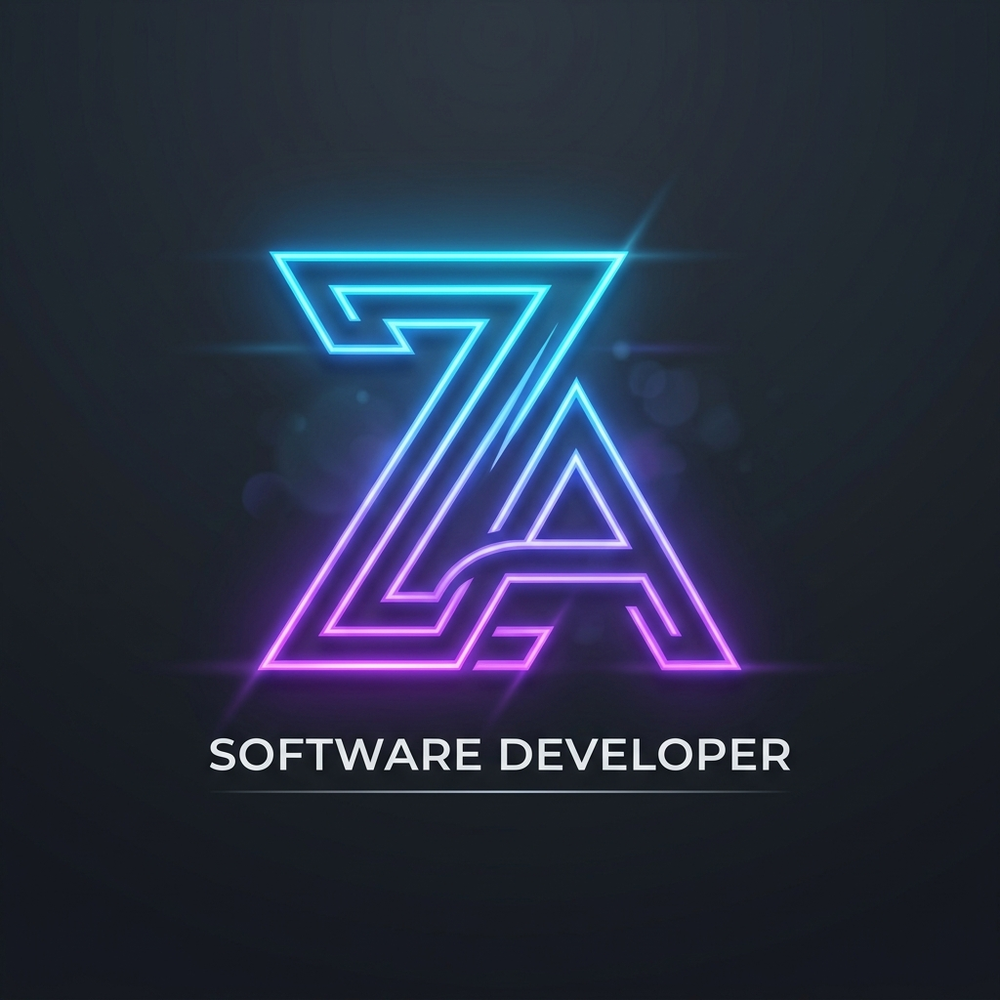

# Zaid Ali | Software Developer Portfolio

A premium, futuristic, and highly professional personal portfolio website for **Zaid Ali**, a Computer Science Engineering student and aspiring Software Developer.



## 🚀 Features

- **Modern UI/UX**: Designed with a sleek dark-navy and blue color palette, featuring glassmorphism and layered depth effects.
- **Dynamic Animations**: Includes typing effects, reveal-on-scroll animations, and smooth transitions.
- **Responsive Design**: Fully optimized for mobile, tablet, and desktop viewports.
- **Interactive Background**: Aesthetic mesh gradients and glowing background elements.
- **Comprehensive Sections**:
  - **Hero**: Impactful entry with typing animation and primary call-to-actions.
  - **About**: Personal background, location, and multilingual proficiency.
  - **Education**: Detailed academic timeline.
  - **Experience**: Highlights of professional internships and roles.
  - **Skills**: Visual representation of technical expertise across programming and web development.
  - **Projects**: Grid showcase of featured work with technology tags.
  - **Achievements**: Recognition and honors earned.
  - **Contact**: Functional contact form and direct links to social profiles.

## 🛠️ Built With

- **HTML5**: Semantic structure.
- **Vanilla CSS3**: Custom styles, animations, and responsive layouts (No frameworks used for maximum control).
- **JavaScript (ES6+)**: Interactive logic and animations.
- **Google Fonts**: Inter and Outfit for premium typography.
- **FontAwesome**: Scalable vector icons.

## 📂 Project Structure

```text
├── index.html      # Main entry point
├── style.css       # Core design system and animations
├── script.js       # Interactive features and animations
├── logo.png        # Brand identity
└── assets/         # Images and other media files
```

## ⚙️ Getting Started

To view the portfolio locally:

1. Clone the repository:
   ```bash
   git clone https://github.com/Xaiiiidddd/zaid-port.git
   ```
2. Open `index.html` in your preferred web browser.

## 👤 Author

**Zaid Ali**
- GitHub: [@Xaiiiidddd](https://github.com/Xaiiiidddd)
- LinkedIn: [Zaid Ali](https://www.linkedin.com/in/zaid-ali-803b10387/)
- Email: [xaidali12345678@gmail.com](mailto:xaidali12345678@gmail.com)

## 📄 License

This project is licensed under the MIT License - see the [LICENSE](LICENSE) file for details.
